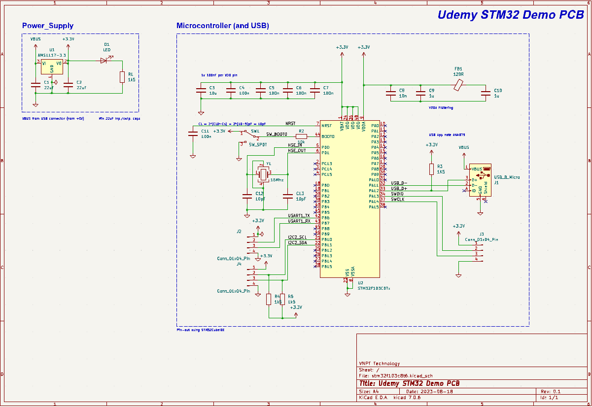
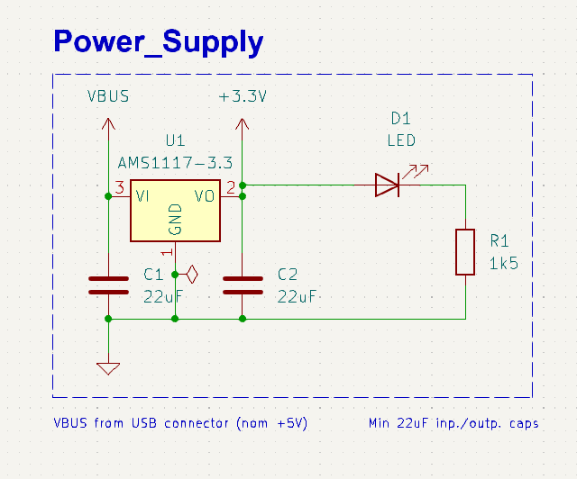
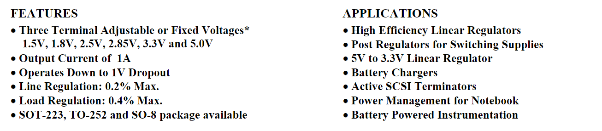
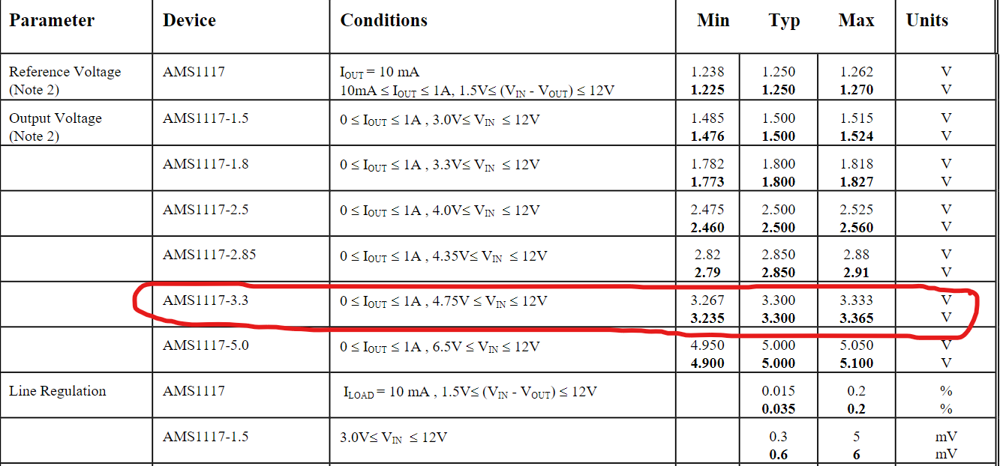
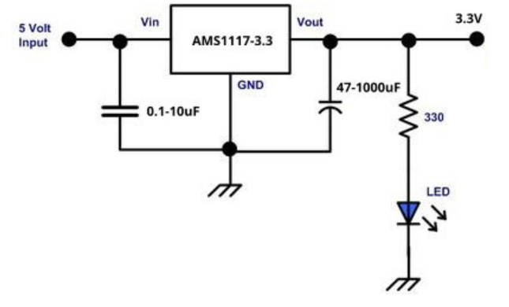
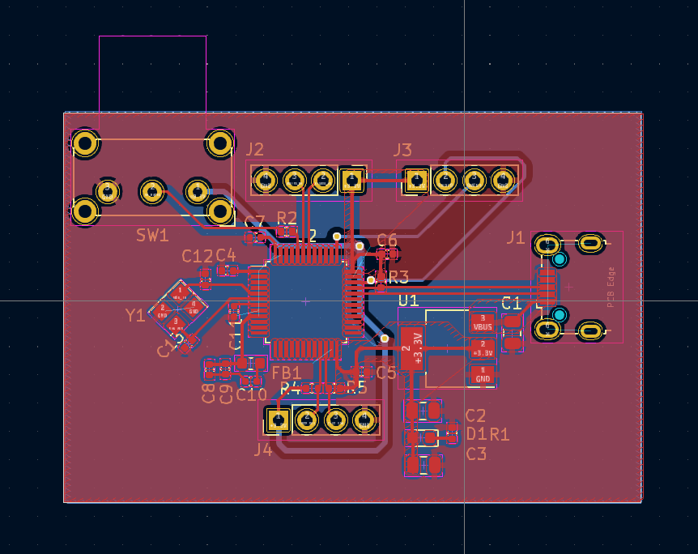
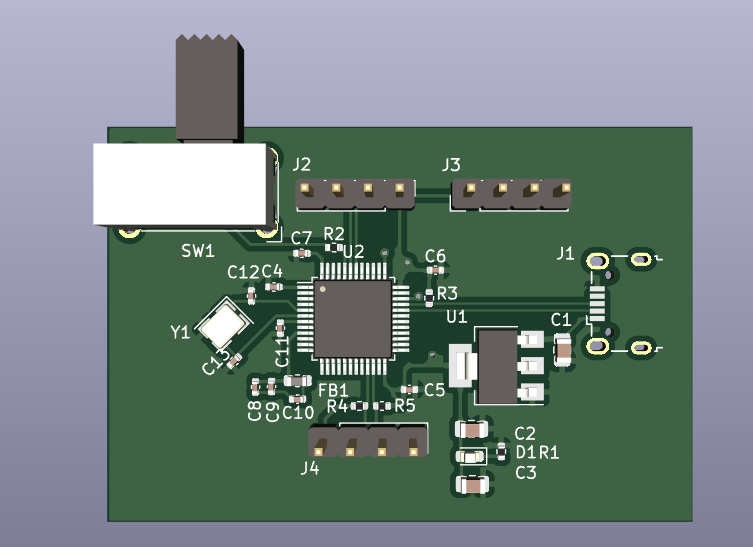
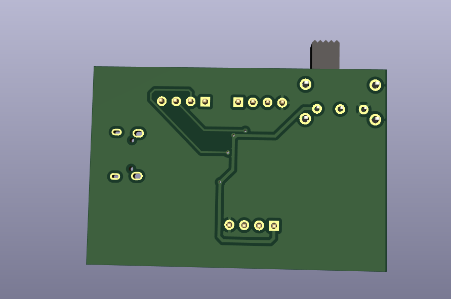

# 1. Introduction
- Hi, I am Toan Nguyen, I learned how to using Kicad for design PCB from 1 week ago.
- I learn Kicad from some video in Youtube in [Phil'sLab](https://www.youtube.com/@PhilsLab), thank channel shared all Knowledge about Kicad for Work.
- This mini project is [course](https://www.udemy.com/course/learn-kicad-v6-and-stm32-hardware-design/learn/lecture/30585336#content) in Udemy of Phil'sLab is shared and free. If you have time, you can join the course.

# 2. Design Schematic
**Total Schematic for STM32F103xxx**

**Power supply:**

I use [ASM117-3.3](https://pdf1.alldatasheet.com/datasheet-pdf/view/205691/ADMOS/AMS1117-3.3.html) as IC main for LDO voltage because:

Current Output of ASM1117 suitable with 1A, Fixed Voltage is 3.3V for VDD of IC STM32F103.

I using micro USB type B, current 10-100mA, Input voltage 5Vdc

Now, we can see [example-ASM1117](https://www.pcboard.ca/ams1117-3-volt-regulator) of manafactory to design for this block:

I using capacitor 0.1-10uF to filter input voltage, capacitor 47-1000uF to filter output voltage. LED is added to display Voltage 3.3V whether or not.

**MCU**
> All design of MCU was referenced in internet with keyword "stm32f103c8 kit schematic", you can find schematic for this design with above keyword.

# 3. Layout
**Layout**

**3D**

**Goodluck!**